<div align="center">


<br/>
<br/>


<h3>Hi, I'm <strong>Bit</strong> 👋 - I keep track of who showed up.</h3>

<p><em>A rotating-OTP attendance system for E-Cell, built like a tool you'd actually enjoy opening.</em></p>

<p>
  
  
  
  
  
</p>

</div>

---

## What it does

Members check in at the E-Cell office with a **6-digit OTP** that rotates every two minutes (shown on an office device). A live **session timer** counts their time up to a 4-hour cap, and on checkout they log what they worked on. Admins get a management console - approve members, manage lookup data, watch session logs - and can sign in with a **one-click email magic link** instead of an OTP.

<div align="center">
<table>
  <tr>
    <td align="center" width="50%">
      <br/>
      <sub><b>OTP login</b> - email + rotating code, or an admin magic link</sub>
    </td>
    <td align="center" width="50%">
      <br/>
      <sub><b>Live session timer</b> - counts up to the 4-hour limit</sub>
    </td>
  </tr>
</table>
</div>

---

## ✨ Features

| | |
| --- | --- |
| 🔐 **Rotating OTP login** | 6-digit codes valid for 120s, single-use, validated server-side |
| ✉️ **Admin magic link** | Passwordless one-click sign-in via Supabase Auth, gated to approved admins |
| ⏱️ **Live session timer** | Counts up to a 4-hour cap with auto-logout and a checkout summary |
| 🧑‍💼 **Member management** | Approve registrations, edit members, manage branches / years / positions |
| 📊 **Session logs** | Sortable history of every check-in, duration, and work description |
| 🎨 **Cursor-inspired UI** | Near-black monochrome theme, Gilroy type, Apple-style spring motion |

---

## 🚀 Getting started

```bash
# 1. install
npm install

# 2. add your environment variables (see below)
cp .env.example .env.local   # then fill it in

# 3. run
npm run dev
```

Open **http://localhost:3000**.

### Environment variables

| Variable | Purpose |
| --- | --- |
| `NEXT_PUBLIC_SUPABASE_URL` | Supabase project URL |
| `NEXT_PUBLIC_SUPABASE_ANON_KEY` | Anon key - used for the magic-link auth flow |
| `SUPABASE_SERVICE_ROLE_KEY` | Service-role key - **server-only**, bypasses RLS |
| `SESSION_SECRET` | Signs the session JWT - must be set, fails loudly if missing |
| `OTP_DEVICE_SECRET` | Bearer token so the office device can fetch the current OTP |

> The database schema lives in [`../schema.sql`](../schema.sql). Run it against your Supabase project to create the tables and seed the lookup data + initial admin.

### Fonts

The UI uses **Gilroy** (self-hosted). It's a commercial font, so it isn't committed - drop the `.woff2` files into [`public/fonts/`](public/fonts) (see the README there). Until then the app falls back cleanly to the system sans-serif.

---

## 🔑 How authentication works

Two ways in, one session model - every protected route reads the signed JWT, never trusts the client.

**Member - OTP**
```
email + 6-digit OTP  →  /api/auth/login  →  verify member (approved, @kccemsr.edu.in)
                                          →  validate + consume OTP
                                          →  create session + mint JWT cookie
```

**Admin - magic link**
```
"Email me a login link"  →  /api/auth/admin-link      →  send Supabase magic link (admins only)
click link in inbox      →  /api/auth/admin-callback   →  verify token (single-use, short-lived)
                                                        →  re-check role = admin
                                                        →  mint the app's JWT  →  /admin
```

> Setting up the magic link requires a little Supabase dashboard config (redirect allow-list + email template). The ready-to-paste template is in [`supabase/email-templates/magic-link.html`](supabase/email-templates/magic-link.html).

---

## 🗂️ Project structure

```
src/
├─ app/
│  ├─ page.tsx              # landing
│  ├─ login/ register/      # auth screens
│  ├─ dashboard/            # live session timer
│  ├─ admin/                # console: users, otp, settings
│  └─ api/
│     ├─ auth/              # login, logout, register, admin-link, admin-callback
│     ├─ admin/             # users, sessions, otp, options (admin-only)
│     └─ session/status     # session polling + auto-logout
├─ components/              # OTPInput, LogoutModal
└─ utils/
   ├─ session.ts            # JWT sign/verify, cookie, requireAdmin
   ├─ supabase.ts           # admin + auth clients
   └─ attendanceSession.ts  # shared "create session + mint JWT"
```

---

## 🎨 Design

A **Cursor-inspired** system: near-black surfaces (`#0a0a0a → #262626`), hairline borders, off-white text, and a single restrained blue accent for focus. Type is **Gilroy** with weight-driven hierarchy; motion follows Apple's *Designing Fluid Interfaces* - critically-damped springs, press feedback on pointer-down, and reduced-motion fallbacks.

---

<div align="center">
<br/>

<br/>
<sub>Built for E-Cell • see you at check-in 👋</sub>
</div>
